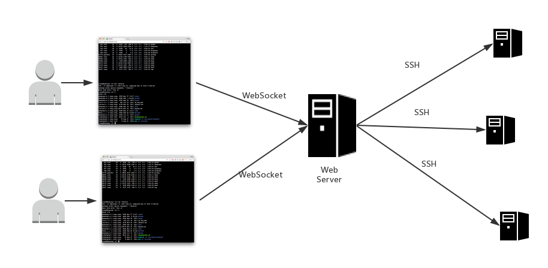

# web-ssh
web ssh terminal by Spring Boot

Java Spring 实现的浏览器端直接SSH连接目标服务器并支持交互操作。

Web SSH 终端的基本原理：

用到的相关依赖和框架：
* SpringBoot, Spring MVC
* WebSocket
* Jsch来实现SSH连接和交互
* 前端主要使用xterm.js：https://github.com/xtermjs/xterm.js
* 参考Python实现：https://github.com/huashengdun/webssh

目前还有一些问题没来得及完成：
* 为了方便调试，目标服务器连接的一些参数暂时写死的，没有从Index页面获取。
* websocket与jsch的交互还有一些基本细节没做好，如终端访问时候的前缀显示和光标停留位置，像这样 [xxx@hostname]$ 
* 实现和测试更多的模拟终端工具的一些操作细节，例如tab键自动补全，Ctr+C终端操作等等。。。

